<!-- Animated Wave Divider -->

  

  

## 🚀 About Me
I'm a passionate developer who loves to work on exciting projects and contribute to open source. I enjoy learning new technologies and sharing my knowledge with the community.

  

## 🗂️ Featured Repositories

  <!-- Replace these with your actual repository names -->
  

  

## 🔄 Recent Activity

  <!-- Recent GitHub activity feed -->
  

  

## Programming Languages

  

## Frontend Development

  

## Backend & Databases

  

## DevOps & Tools

  

  

## � Let's Connect & Have Fun!

  
  
  
  
  

  

## 🎧 Spotify Playing

  

  

## 🚀 Current Project: Guppy Classifier (Flutter App)

Guppy Classifier is a mobile application designed to identify and evaluate guppy fish classes using image-based classification. The app focuses on providing accurate and reliable classification results through an easy-to-use scanning system, making it useful for learning, testing, and analysis.  
The application offers two classification methods. The first is Camera Classification, where users capture a photo in real time to perform accuracy testing. The second is Gallery Classification, which allows users to select an existing image from their device’s gallery for classification and accuracy evaluation.
  
To support tracking and review, Guppy Classifier includes a Classification History feature that records all previous classification results. Users can view past tests and apply filters based on the image source (camera or gallery) as well as the type of class, making it easier to analyze results efficiently.

  

### 🧬 Guppy Classes Overview

Below is a quick overview of the Guppy classes that Guppy Classifier can recognize, with a short description and a sample image for each class.

<table>
  <tr>
    <th align="left">Class Name</th>
    <th align="left">Description</th>
    <th align="center">Sample Image</th>
  </tr>
  <tr>
    <td><strong>Albino Full Red</strong></td>
    <td>The Albino Full Red guppy is known for its striking solid red coloration that covers the entire body and fins. Due to albinism, it has light-colored or pinkish eyes and a pale head. This variety is highly valued for its uniform color and bright appearance, making it stand out in aquariums.</td>
    <td align="center"></td>
  </tr>
  <tr>
    <td><strong>Black Moscow</strong></td>
    <td>The Black Moscow guppy features an intense, deep black coloration that extends from head to tail, including the fins. Its smooth, velvety color gives it a bold and elegant look. This guppy is popular for its consistency in color and strong body structure.</td>
    <td align="center"></td>
  </tr>
  <tr>
    <td><strong>Blue Dragon</strong></td>
    <td>The Blue Dragon guppy is distinguished by its metallic blue body combined with a dragon-scale or mosaic pattern. The scales appear thick and reflective, giving the fish a textured and shimmering effect. Darker fins enhance its dramatic appearance.</td>
    <td align="center"></td>
  </tr>
  <tr>
    <td><strong>Cobra</strong></td>
    <td>The Cobra guppy is recognized by its snake-like patterns along the body, often mixed with spots, stripes, or rosettes. These patterns usually contrast with a lighter base color. The tail and dorsal fins often display matching detailed designs.</td>
    <td align="center">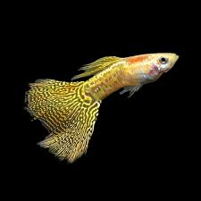</td>
  </tr>
  <tr>
    <td><strong>Dumbo Ear</strong></td>
    <td>The Dumbo Ear guppy is easily identified by its large, rounded pectoral fins that resemble elephant ears. These fins are often brightly colored and larger than those of standard guppies. The body color may vary, but the oversized fins are its main feature.</td>
    <td align="center"></td>
  </tr>
  <tr>
    <td><strong>Endler's</strong></td>
    <td>Endler’s guppy is smaller and slimmer than regular guppies, with vibrant colors and unique patterns. Males are especially colorful, displaying neon shades of green, orange, and black. This variety is known for its active behavior and adaptability.</td>
    <td align="center"></td>
  </tr>
  <tr>
    <td><strong>HB Pastel</strong></td>
    <td>The HB (Half Black) Pastel guppy has a darker front body and a half-black rear body that blends into soft pastel-colored fins. The tail often shows light hues such as yellow, blue, or pink. This combination creates a gentle yet elegant appearance.</td>
    <td align="center"></td>
  </tr>
  <tr>
    <td><strong>Panda</strong></td>
    <td>The Panda guppy has a white or silver body with contrasting black patches, particularly around the head, tail, or midsection. The color distribution resembles a panda’s markings. This variety is admired for its balanced and eye-catching contrast.</td>
    <td align="center">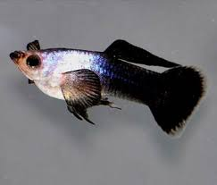</td>
  </tr>
  <tr>
    <td><strong>Platinum White</strong></td>
    <td>The Platinum White guppy displays a shiny, silvery-white body with a metallic sheen. Its color is smooth and uniform, often reflecting light beautifully in water. This guppy is appreciated for its clean, bright, and minimalist look.</td>
    <td align="center"></td>
  </tr>
  <tr>
    <td><strong>Red Dragon</strong></td>
    <td>The Red Dragon guppy features a vivid red body combined with a dragon-scale pattern that gives it a textured, armored appearance. Darker edges on the fins add depth to its coloration. It is a premium variety known for its bold color and strong presence.</td>
    <td align="center"></td>
  </tr>
</table>

  

### 🏠 Home Page

<table>
  <tr>
    <td align="center">
      <strong>Home Page</strong> 
      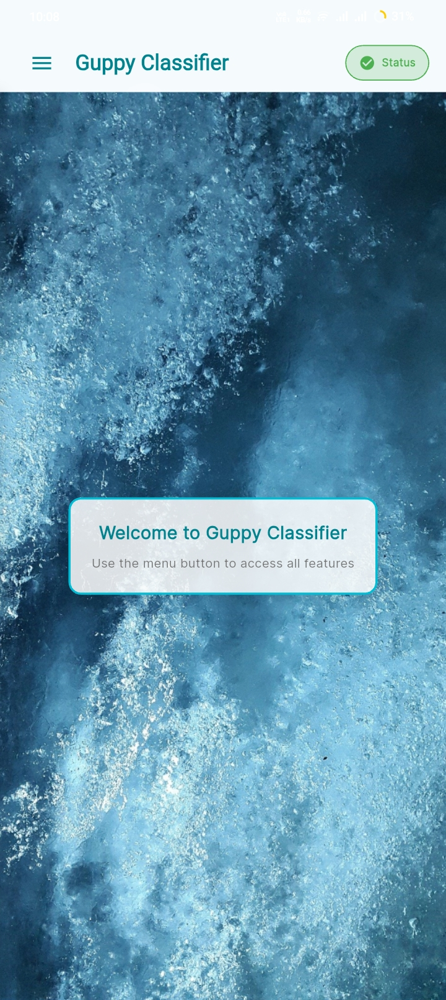 
      The Main Page is the starting point of the app. From here, users can navigate to the dictionary, open the camera or upload screen, and access other features of Guppy Classifier.
    </td>
    <td align="center">
      <strong>Status</strong> 
      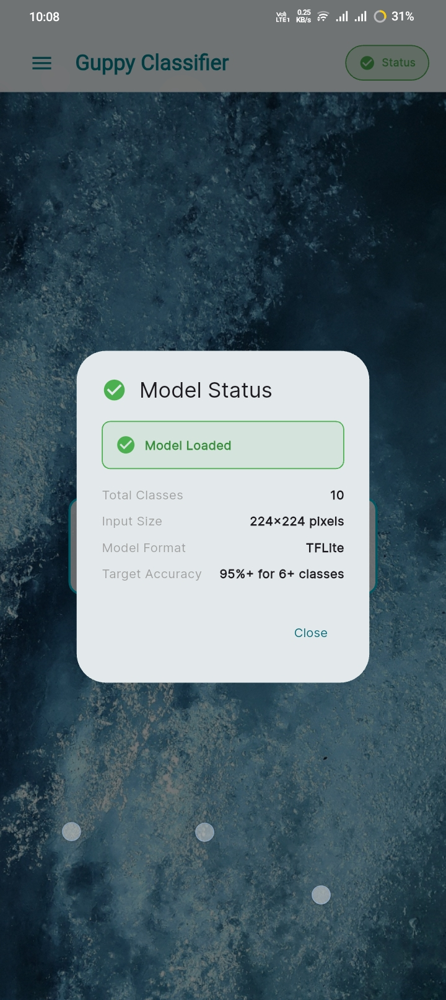 
      The Status is where you can view the (Model status, total classes, model format and target accuracy).
    </td>
  </tr>
</table>

  

### Supported Guppy Classes 

Below are sample screens and detailed visual references showing the Guppies that Guppy Classifier can classify. The app screenshots display how each guppy class appears in the application interface, while the detailed images showcase the distinctive characteristics, color patterns, and physical features that help identify each guppy variety. These references help users understand the visual differences between classes and improve their ability to recognize guppies in real-world scenarios.

  <strong>App Screenshots</strong>

  
  
  
  
  

  
  
  
  
  

  <strong>Detailed Class Information</strong>

  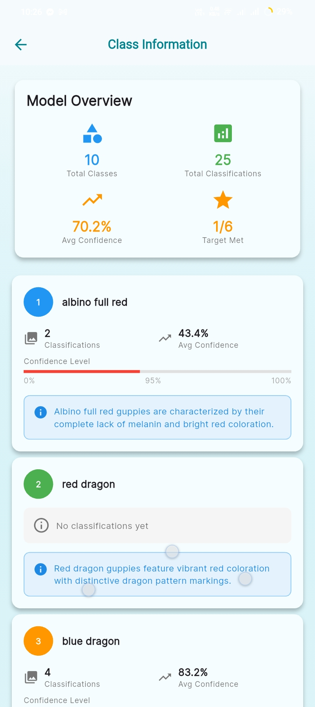
  
  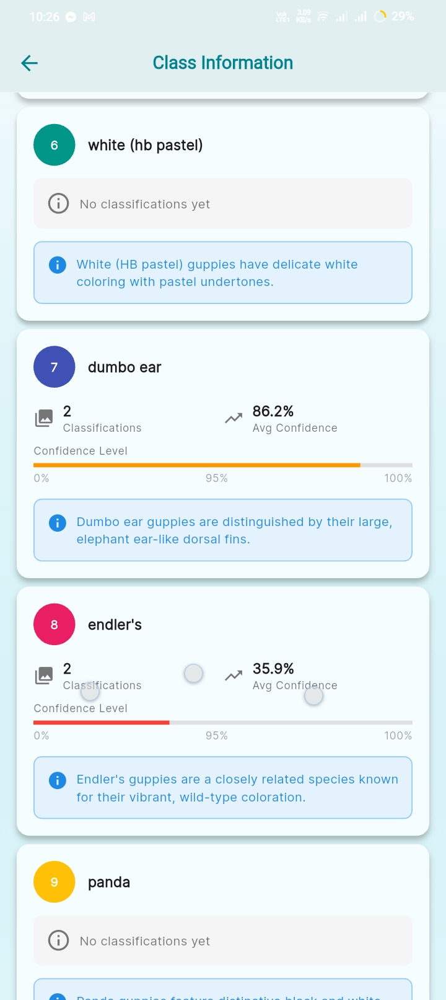
  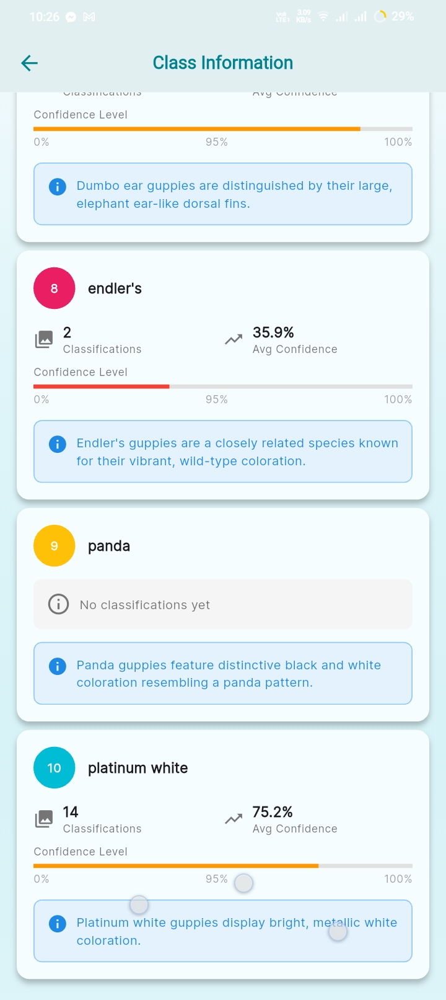

These screens and images show the guppies included in the model, helping users know which guppies they can scan with the app and understand their distinguishing features.

  

### 📷 Capture or Upload Images & ✅ Scan Result

<table>
  <tr>
    <td align="center">
      <strong>Capture or Upload Images</strong> 
      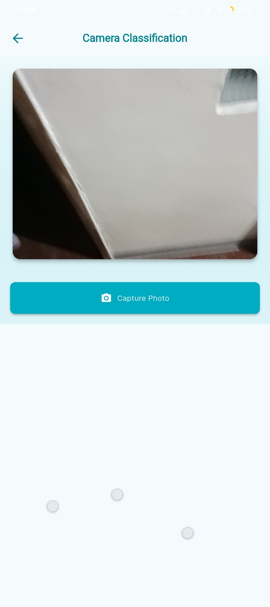
      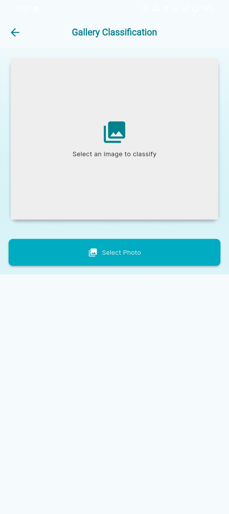 
      Users can either take a new photo using the camera or upload an existing image from their device. These images are then sent to the model for guppy classification.
    </td>
    <td align="center">
      <strong>Scan Result</strong> 
       
      After a scan, the Result screen shows the predicted guppy class along with confidence percentages, so users can see how likely each class is.
    </td>
  </tr>
</table>

  

### 📈 Analytics Charts & 🕒 Scan History

<table>
  <tr>
    <td align="center">
      <strong>Analytics Charts</strong> 
      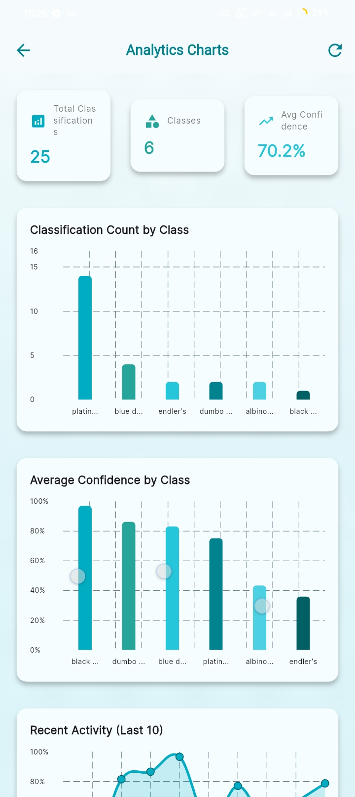
      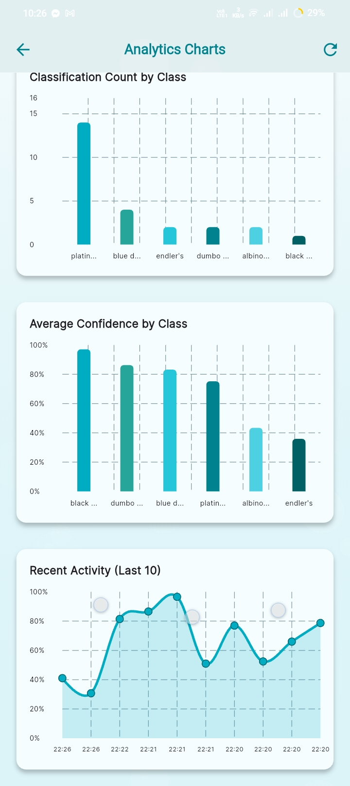 
      The Analytics screen summarizes how the app is being used, including how many detections each guppy class has. The Detections per Class chart visualizes how often each type of guppies has been scanned.
    </td>
    <td align="center">
      <strong>Scan History</strong> 
      
      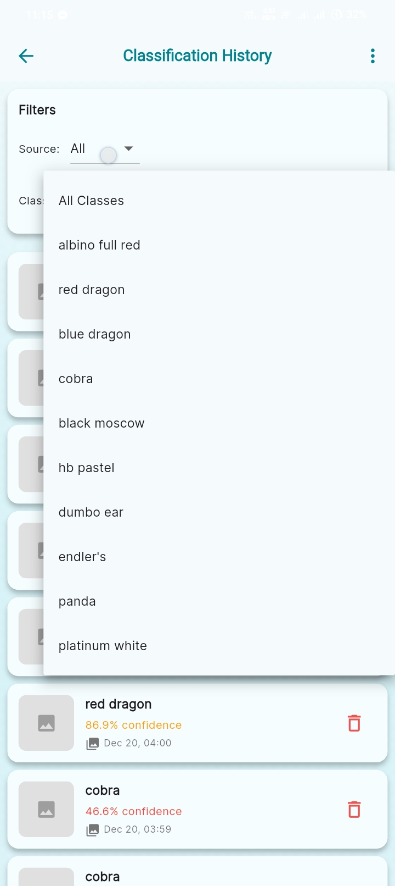
      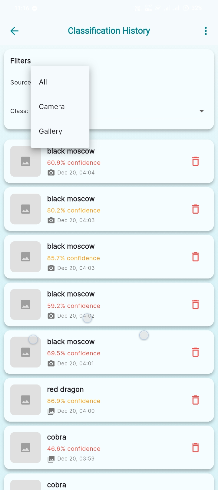
      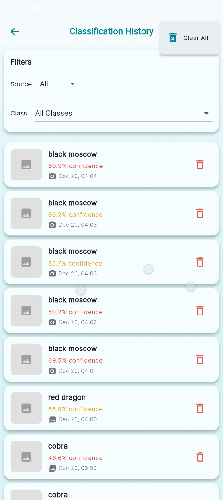 
      The History page keeps a record of past scans, including the detected class, accuracy and sources. This lets users review previous results and track their usage of Guppy Classifier.
    </td>
  </tr>
</table>

  

### 🚀 Key Features Summary
<table>
  <tr>
    <th align="left">Feature</th>
    <th align="left">Description</th>
  </tr>
  <tr>
    <td><strong>Image Capture & Upload</strong></td>
    <td>Users can either take a new picture of a guppy using the camera or choose an existing photo from their gallery as input for classification.</td>
  </tr>
  <tr>
    <td><strong>Guppy Class Recognition</strong></td>
    <td>The app runs an image classification model to predict which guppy class the sample belongs to, based on the supported species in the built-in class-info.</td>
  </tr>
  <tr>
    <td><strong>Confidence-Based Results</strong></td>
    <td>Each scan displays confidence values for the detected class, helping users understand how certain the model is about its prediction.</td>
  </tr>
  <tr>
    <td><strong>Interactive Class Information</strong></td>
    <td>A reference section where users can browse the available guppy classes, view their images, and read short descriptions before or after scanning.</td>
  </tr>
  <tr>
    <td><strong>Usage Analytics</strong></td>
    <td>Analytics charts provide an overview of which guppies are scanned the most and how the model has been used over time.</td>
  </tr>
  <tr>
    <td><strong>Scan History</strong></td>
    <td>The app keeps a record of previous scans, showing the detected class, accuracy, and sources so that users can revisit earlier results.</td>
  </tr>
  </table>

  

